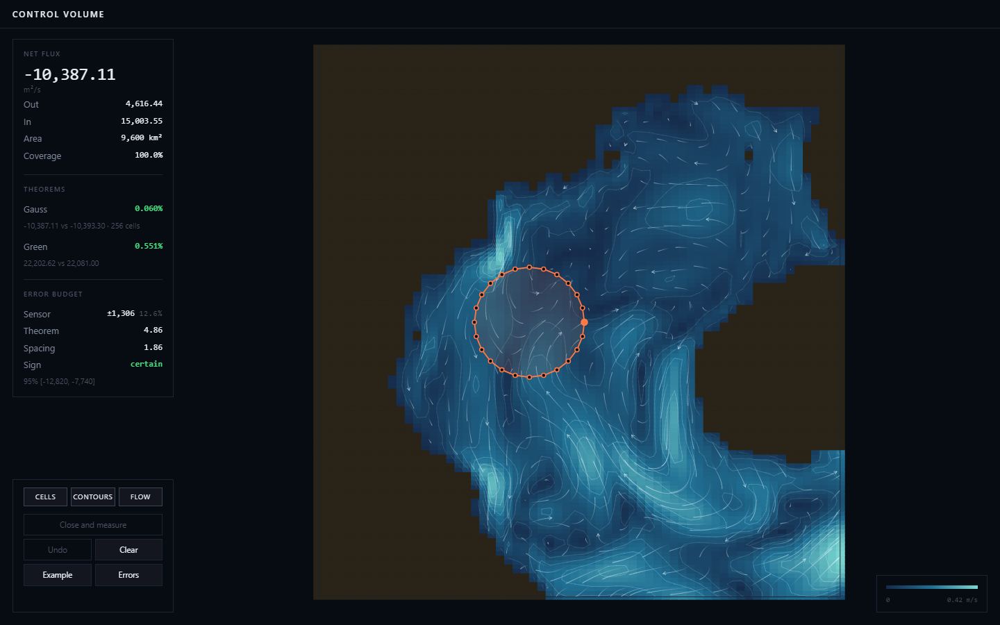

# control-volume-analysis

Measure water crossing a boundary you draw, then check the answer against the divergence inside it.



Python 3.11+ · Gulf of Tonkin, HYCOM

---

**The two sides agree.** 0.5° boundary, 9,600 km², m²/s.

```
Gauss    -10,387.11   vs  -10,393.30      0.060%
Green     22,202.62   vs   22,081.00      0.551%
```

**The sensors decide everything.** Same boundary, three error sources.

```
sensor  ±0.05 m/s, ±5°      ±1,305.8      12.6%
theorem gap                      4.86     0.047%
boundary spacing                 1.86     0.018%
```

**Against ECMWF**, whose own divergence of the same flux is computed spectrally on the whole globe. 

```
order 2     r 0.9781    slope 0.9322    RMS 20.1%
order 4     r 0.9858    slope 0.9745    RMS 16.2%
```

---

**Matching the interpolation order to the difference order** is right on average and wrong often. 

```
order 2 bilinear    median 2.248%    worst 26.007%    best on  0
order 2 bicubic            2.358%          14.001%             6
order 4 bilinear           2.078%          22.937%             7
order 4 bicubic            1.594%          10.752%            11
```

---

The cosine sits inside the latitude derivative. Area comes from `∮ R² sin φ dλ`, exact on a spherical band. Land is `nan`, never zero. Instrument error is applied to speed and bearing, not to components. Finite-difference steps follow the grid, because below one cell they measured interpolation noise. The optimiser sweeps before Newton, which otherwise finds a saddle.

```
field.py      
analysis.py   
era5.py      
serve.py      
```

An ERA5 month is 1,256 MB; one window costs 6 requests and 22.9 MB.
